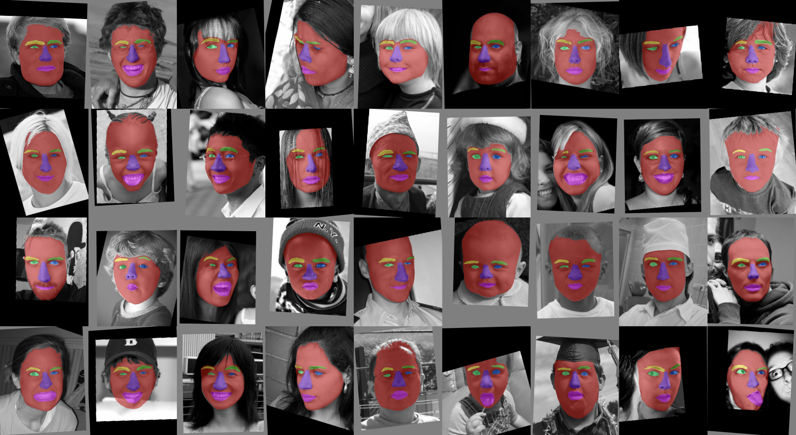

## pre-trained deep network for face segmentation
a modified nnUNet (see below) network was trained with the Helen Star* Face dataset, references:
- https://github.com/JPlin/Relabeled-HELEN-Dataset
- https://openaccess.thecvf.com/content_CVPR_2019/papers/Lin_Face_Parsing_With_RoI_Tanh-Warping_CVPR_2019_paper.pdf
- https://github.com/MIC-DKFZ/nnUNet

in case you need to re-train a similar network, simply copy the file into nnUNetTrainerV2_123.py
pyair/lib/python3.9/site-packages/nnunet/training/network_training/nnUNet_variants/architectural_variants/
and convert it as follows:
```
from nnunet.training.model_restore import load_model_and_checkpoint_files
import torch
import torch.nn as nn
import torch.nn.functional as F
model = 'Task256_Helen/nnUNetTrainerV2_123__nnUNetPlansv2.1/'
folds = [0]; mixed_precision = True; checkpoint_name = 'model_final_checkpoint'
trainer, params = load_model_and_checkpoint_files(model, folds, mixed_precision=mixed_precision, checkpoint_name=checkpoint_name)
trainer.network.load_state_dict(params[0]['state_dict'])
model = trainer.network
model.eval()
print('done')
script = torch.jit.trace(model,torch.zeros(1,1,256,256))
torch.jit.save(script,'nnunet_helen_fast.pth')

for the streamlit demo the scripted version (pytorch jit) is already available, for best performance on Apple Silicon (M1) we convert it again to a coreml model on the fly
```
import torch
import coremltools as ct
model = torch.jit.load('nnunet_helen_fast.pth')
mlmodel = ct.convert(model,inputs=[ct.TensorType(shape=torch.randn(1,1,256,256,).shape)],compute_units=ct.ComputeUnit.CPU_AND_GPU,minimum_deployment_target=ct.target.iOS15,convert_to="mlprogram")

```


